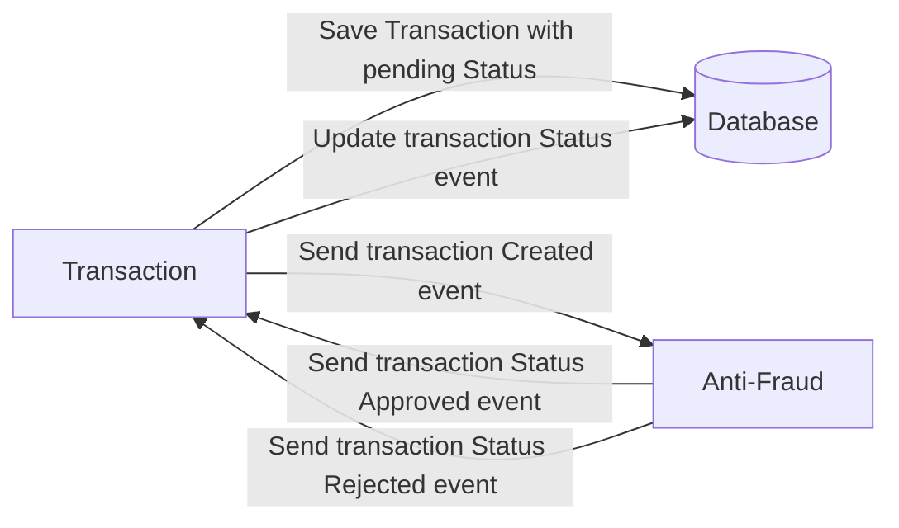

# Yape Code Challenge :rocket:

Our code challenge will let you marvel us with your Jedi coding skills :smile:. 

Don't forget that the proper way to submit your work is to fork the repo and create a PR :wink: ... have fun !!

- [Yape Code Challenge :rocket:](#yape-code-challenge-rocket)
- [Problem](#problem)
- [Tech Stack](#tech-stack)
  - [Optional](#optional)
- [Send us your challenge](#send-us-your-challenge)
- [El paso a paso](#el-paso-a-paso)
  - [Creando el proyecto con nestjs](#creando-el-proyecto-con-nestjs)
  - [Instalar dependencias](#instalar-dependencias)
  - [completando la estructura de careptas y archivos](#completando-la-estructura-de-careptas-y-archivos)

# Problem

Every time a financial transaction is created it must be validated by our anti-fraud microservice and then the same service sends a message back to update the transaction status.
For now, we have only three transaction statuses:

<ol>
  <li>pending</li>
  <li>approved</li>
  <li>rejected</li>  
</ol>

Every transaction with a value greater than 1000 should be rejected.



# Tech Stack

<ol>
  <li>Node. You can use any framework you want (i.e. Nestjs with an ORM like TypeOrm or Prisma) </li>
  <li>Any database</li>
  <li>Kafka</li>    
</ol>

We do provide a `Dockerfile` to help you get started with a dev environment.

You must have two resources:

1. Resource to create a transaction that must containt:

```json
{
  "accountExternalIdDebit": "Guid",
  "accountExternalIdCredit": "Guid",
  "tranferTypeId": 1,
  "value": 120
}
```

2. Resource to retrieve a transaction

```json
{
  "transactionExternalId": "Guid",
  "transactionType": {
    "name": ""
  },
  "transactionStatus": {
    "name": ""
  },
  "value": 120,
  "createdAt": "Date"
}
```

## Optional

You can use any approach to store transaction data but you should consider that we may deal with high volume scenarios where we have a huge amount of writes and reads for the same data at the same time. How would you tackle this requirement?

You can use Graphql;

# Send us your challenge

When you finish your challenge, after forking a repository, you **must** open a pull request to our repository. There are no limitations to the implementation, you can follow the programming paradigm, modularization, and style that you feel is the most appropriate solution.

If you have any questions, please let us know.


# El paso a paso
## Creando el proyecto con nestjs
```bash
nest new .
```
## Instalar dependencias 
```bash
npm install @nestjs/typeorm typeorm pg kafkajs
```

## completando la estructura de careptas y archivos
```bash
mkdir -p src/transactions/dto
touch src/app.module.ts src/main.ts src/anti-fraud.service.ts src/transactions/transactions.module.ts src/transactions/transaction.entity.ts src/transactions/dto/create-transaction.dto.ts src/transactions/dto/transaction.dto.ts src/transactions/transactions.controller.ts src/transactions/transactions.service.ts docker-compose.yml Dockerfile test/jest-e2e.json test/setup.ts test/app.e2e-spec.ts test/transactions.e2e-spec.ts
````
